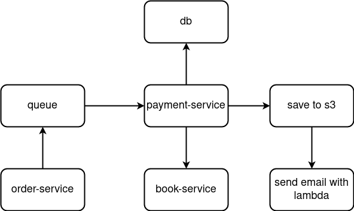
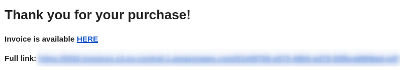
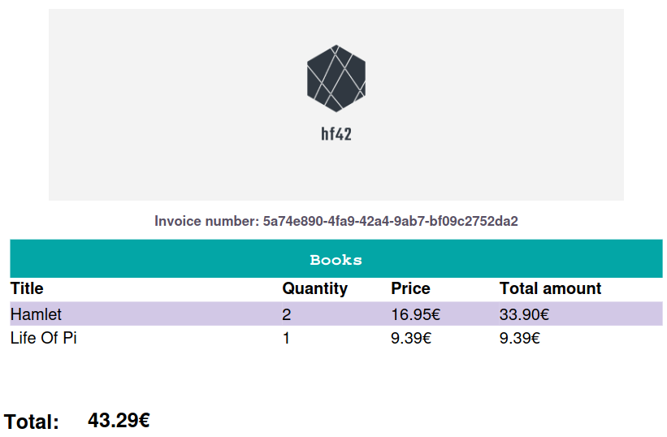

    
    
    
    
    
    
    
    
    
    
    
    
    

Book store project with support for managing books, users, orders, and payments. The [book-service](book-service) is a
REST API that provides CRUD operations for books and was made with Go. The [user-service](user-service)
provides CRUD operations for users and was made with Spring Boot and Kotlin.

The [order-service](order-service) provides CRUD operations for orders and was made with Quarkus. After an order is
created, it is sent to a [RabbitMQ](messaging) queue. The [payment-service](payment-service) reads orders from the queue
and, if a given user is valid, which is validated by the *user-service*, simulates a payment. It creates a
payment record in the database, generates a PDF invoice, and uploads it to AWS S3. At this point,
AWS [Lambda](email-lambda) is triggered, which sends an email with the invoice to the user.

  
   
  <i>Invoicing.</i>

 

  
   
  <i>Email with a link to the invoice.</i>

 

  
   
  <i>An example of an invoice.</i>

 

The [gateway](gateway) is a reverse proxy that uses Kong to route requests to the other services. The [website](website)
is a React application that uses micro frontends to display the books.

Payment service uses MySQL for storage, other services use MongoDB.
